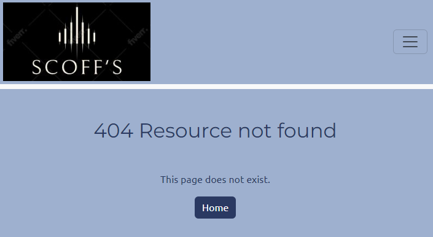

# Project #4 Scoffs Restaurant

This application is a table booking systm for Scoffs Restaurant.
Scoffs doesnt exist, and the address listed in the footer is fake.
coffs customers can register using an email address and password, and may then reserve a table for a number of people, on a date in the future at a certain time.

[Website - Scoffs](https://pf4-scoffs-2c918dbf1aba.herokuapp.com/)

## Contents
- [Goals](#goals)
- [Scope and Features](#scope-and-features)
- [Planning](#planning)

  - [Wireframes](#wireframes)
  - [Entity model](#entity-model)

  - [Epics and User Stories](#epics-and-user-stories)
      - [Setup](#setup)
      - [Authentication](#authentication)
      - [Booking](#booking)
      - [Deployment](#deployment)
      - [Testing](#testing)
      - [Documentation](#documentation)

 - [Website Design](#website-design)
 - [Technologies Used](#technologies-used)
   - [Django / python modules used](#django-python-modules-used)
   - [Git / GitHub](#git-github)

- [Credits](#credits)
 ---

### Goals

    The application is to allow users to register with an email address and a password, and then they will be able to create a restaurant reservation.
    They will be able to subsequently edit or delete their own reservation(s).
    Staff users will be able to create reservations for customers, and will have authority to edit or delete any customers' reservations.

---

## Scope and Features

    Some features are restricted from users and allowed for staff.
    Responsiveness - the site is responsive from 320px upwards, with a collapsing navbar for smaller displays.
    The home page features a random main image.

---
### Planning

    Project planning was done with Agile methodologies.

[Agile project](https://github.com/users/mark279455/projects/8/views/1)

#### Wireframes

- Base template wide

- Base template mobile

- Homepage wide

- Homepage mobile

- Register page wide

- Register page mobile

- Login page wide

- Login page mobile

- Logout page wide

- Logout page mobile

- List Bookings page wide

- List Bookings page mobile

- Add Reservation page wide

- Add Reservation page mobile

- Edit Reservation page wide

- Edit Reservation page mobile

- Delete Reservation page wide

- Delete Reservation page mobile

- Error 403 page wide

- Error 403 page mobile

- Error 404 page wide

- Error 404 page mobile

- Error 500 page wide

- Error 500 page mobile

    The end design differed from the wireframes slightly in all areas, but mainly the list_bookings page.
    A container type rather than a table was preferred.

--- 

### Entity Model
    The database design consists of 2 custom tables

    Models for Booking and Table were created.
    The bookings_booking Model uses bookings_table.id to access the Table model, and auth_user.id to access the User Model.

    Full Create, Read, Update Delete functionality was achieved.

---

---

#### Epics and User Stories

    Epics created were as follows with listed User Stories:

## Setup
    This epic was to basically setup the system for development. Initialise the application, create the static resources needed by everything else.

``USER-STORY: - As a developer i must create and setup the default project basics so that the project may continue``
 - Basic project creation
    - pip install Django
    - jango-admin startproject main

``USER-STORY: - As a developer i must create the base static resources so that app html may inherit.``
 - Create base.html as a base for all other pages

``USER-STORY: - As a developer i must create the header, navbar and footer with social media links and contact information so that the homepage is complete.``
 - header.html, footer.html created in templates/includes folder

    Header:
        The header features a restaurant logo, with a varying number of links.
            
            Home:

            Only visible if logged in:
                Logout
                Book a Table
                List your Bookings
                    (If the signed in user is staff, this link is "List all Bookings")

            Only visible if not logged in:
                Register
                Login

        Not logged in:

        Logged in

    Footer:
        The footer features the Restaurant address and Social media icons for Facebook, Instagram, Twitter and Youtube

    Homepage:
        A new app is created for the home page - python manage.py startapp home
        The homepage is created in the home app in the templates/home directory, and imports the html from the base.html.
        The homepage features a simple randomised image with some welcome text and a "Make a Booking" button.

---

``USER-STORY: - As a developer, I need to create a 403 error page to show unauthorised access``

    This page is to notify an http error 403.

``USER-STORY: - As a developer, I need to create a 404 error page to announce missing pages``

    This page is to notify an http error 404.

``USER-STORY: - As a developer, I need to create a 500 error page to alert server errors``

    This page is to notify an http error 500.

## Authentication
    This epic was to install allauth. Allauth will manage registration, email verification, and login / logout functionality. It must be configured align with the website style.
            
``USER-STORY: - As a developer, I need to implement allauth to control user authentication``
 - Django allauth was installed, and the allauth account directory was copied to the templates directory.

 ---

``USER-STORY: - As a business owner, I want users to verify their email when registering, to capture invalid addresses``
 - This configuration was done in settings.py.

``USER-STORY: - As a business owner, I would like the authentication page styles to match the rest of the site.``
 - The following files were edited to align with the website styling.

     - signup.html
     - login.html
     - password_reset_from_key.html
     - password_set.html
     - password_change.html
     - password_reset.html
     - email_confirm.html
     - logout.html
     - verification_sent.html

---

## Booking
    The booking epic includes all the functionality required to list/manage, create, edit and delete bookings.

``USER-STORY: - As a customer, I want to be able to create a booking``
 - An add_booking page was added, with a corresponding AddBookingView.

``USER-STORY: - As a customer, I would like to be able to see my bookings``
 - A list_bookings page was added, with a corresponding ListBookingView.

``USER-STORY: - As a customer, I would like to be able to edit my bookings``
 - A edit_booking page was added, with a corresponding EditBookingView.

``USER-STORY: - As a customer, I need to delete a booking``
 - A booking_confirm_delete page was added, with a corresponding DeleteBookingView.

``USER-STORY: - As staff, I want to search bookings by reference, name or booking date``
 - Changes were made to the list_bookings page to allow a staff user to search by name, date or reference.

``USER-STORY: - As a staff user I can create, edit and delete any customer bookings so that I can manage the tables in the restaurant``
 - When staff users are logged in, the filter that removes other users bookings is removed, so that Staff users can change any booking.

``USER-STORY: - As a customer, I need a confirmation that my booking was successful``
 - confimation messages, by use of bootstrap toasts confirm operations on all screens

---

## Deployment
 - This epic is the deployment of the application to Heroku - application parameters and configuration of heroku

``USER-STORY: - As a developer, i must deploy to heroku to allow public access``

 - Deployment to Heroku
    - Navigate to the heroku [website](https://id.heroku.com/login) and create an account if you dont have one.
    - Create a new app
    - Give it a name and select your region - create app
    - Goto resources, and add Heroku postgres as an add-on, select the price plan that you desire
    - Click on settings, and reveal config vars
      - The following vars must be defined...

 - DATABASE_URL should have been populated by heroku
 - EMAIL_HOST_USER - is the sendng email address for user email verification (from signup).
 - EMAIL_HOST_PASS - is the sendng email address password for user email verification (from signup).
 - HEROKU_HOSTNAME - is the url which the app is deleivered by.
 - SECRET_KEY - is a string that the django application needs to run.

    - Go to the Deploy tab.
    - Connect to GitHub, sign in and connect to the required repository.
    - Scroll down to manual Deploy, select the main branch, and click deploy.

    The app will be deployed in a few minutes.

    [Scoffs Website](https://pf4-scoffs-2c918dbf1aba.herokuapp.com/)

## Tests
 - Tests for the application.

``USER-STORY: - As a developer I can run tests on my application so that parts of the app can be accepted as reliable``
 - The TESTING.md file contains all testing information.

---

## Documentation
 - Doumentation of the application and the testing

``USER-STORY: - As a developer I can document testing (TESTING.md) so that the application is documeted``
 - The TESTING.md file contains all testing information.

``USER-STORY: - As a developer I can complete README.md so that the project is documented``
 - This file is the documentation for the project.

---

## Website Design

 - Colours
   - The colours were chosen late in the project as the chosen colour scheme performed badly within the Lighthouse tests.

   - The background is a pale gray/blue #9EB0CF.
   - Text is a dark blue #2A3962.
   - Off white where needed #f0f0f0.

 - Fonts
    - The main body is Ubuntu with a sans-serif backup.
    - All headings are Montserrat with a sans-serif backup.
    - These are both Google fonts and are loaded in base.css

 - Logo
    - the logo was created by Looka

 - Hero Images
    - The homepage images were taken from pexels

---
## Technologies Used

 - Technologies used:

   - HTML
        Web page structure
   - CSS
        Web page styling
   - Bootstrap        
        Web page styling
   - Javascript
        Used by Bootstrap
   - VS-Code
        Microsoft Integrated Development Environment - used to code the project
   - Django
        Framework for building web applications
   - Python
        Main programmilg language used in Django
   - Git / GitHub
        Used for verion control and archiving
   - balsamiq
        Used for wireframes
   - uxwing
        Social media icons
   - favicon.io
        Used to create the favicons
   - freeconvert.com
        Used to turn images from .jpg to .webp - to increase page load times

## Django python modules used

 - Django==4.2.4        -   Framework of project
    - asgiref==3.7.2
    - sqlparse==0.4.4
    - tzdata==2023.3

 - django-allauth==0.54.0        -   Authorisation
    - Dependecies
        - Django==4.2.4
            - asgiref==3.7.2
            - sqlparse==0.4.4
            - tzdata==2023.3
        - PyJWT==2.8.0
        - python3-openid==3.2.0
            - defusedxml==0.7.1
        - requests==2.31.0
            - certifi==2023.7.22
            - charset-normalizer==3.2.0
            - idna==3.4
            - urllib3==2.0.4
        - requests-oauthlib==1.3.1
        - oauthlib==3.2.2
        - requests==2.31.0
            - certifi==2023.7.22
            - charset-normalizer==3.2.0
            - idna==3.4
            - urllib3==2.0.4

 - crispy-bootstrap5==0.7        -   Use bootstrap5 with crispy forms
    - Dependecies
        - Django==4.2.4
            - asgiref==3.7.2
            - sqlparse==0.4.4
            - tzdata==2023.3
        - django-crispy-forms==2.0        -   Styling forms
            - Django==4.2.4
            - asgiref==3.7.2
            - sqlparse==0.4.4
            - tzdata==2023.3

 - cryptography==41.0.3        -   Encryption
    - Dependecies
        - cffi==1.15.1
            - pycparser==2.21

 - dj-database-url==2.0.0        -   used in heroku parses database url
    - Dependecies
        - Django==4.2.4
            - asgiref==3.7.2
            - sqlparse==0.4.4
            - tzdata==2023.3
        - typing_extensions==4.7.1

 - django-admin-rangefilter==0.10.0        -   search between dates
 
 - django-random-image-from-folder==0.0.3        -   pick random homepage image
 
 - gunicorn==21.2.0        -   HTTP Server
    - Dependecies
        - packaging==23.1

 - psycopg2-binary==2.9.7        -   needed for Heroku

 - pycodestyle==2.11.0        -   pep8 checker

 - whitenoise==6.5.0        -   serves static files

 - black==23.7.0        -   This was used for code formatting, and is not part of the project

## Git Github

- Git
    - Git and GitHub were used for Verion Control.

    
    The following instructions were used.

     - git add [filename] - or [.]
        - add files to staging

     - git commit -m "commit message"
        - commit changes and label them

     - pit push
        - push changes to repository

---

## Credits

    Thanks to Gareth McGirr my mentor and his wife Daisy for her Youtube video 
[Django Recipe Sharing Tutorial](https://www.youtube.com/watch?v=sBjbty691eI&list=PLXuTq6OsqZjbCSfiLNb2f1FOs8viArjWy)
