## Contents

1.  [Manual Tests](#manual-tests)
    - [User Authentication](#user-authentication)
        - [Is the entered email address of a valid format?](#is-the-entered-email-address-of-a-valid-format)
        - [Is-the-entered-password-suitable?](#is-the-entered-password-suitable)
        - [Email address and password valid](#email-address-and-password-valid)
    - [User Functions](#user-functions)
        - [User can logout](#user-can-logout)
    - [Navigtion](#navigtion)
        - [Link Tests](#link-tests)
    - [Application Functions](#application-functions)
        - [Book a Table](#book-a-table)
        - [Edit a booking](#edit-a-booking)
        - [Delete a booking](#delete-a-booking)
        - [Form Validation](#form-validation)
            - [Empty Fields](#empty-fields)
            - [Booking date requested from the past](#booking-date-requested-from-the-past)
        - [Booking cannot be made if the party size is greater than the biggest table](#booking-cannot-be-made-if-the-party-size-is-greater-than-the-biggest-table)

2.  [Industry Tests](#industry-tests)
    - [HTML Validator](#w3-html-validator)
    - [Lighthouse](#lighthouse)
    - [Wave](#wave)
    - [Pep8](#pep8)

# 

# Manual Tests

## User Authentication

### Is the entered email address of a valid format?

Test:

    Ensure that the application only accepts valid email addresses

Directions:

    1.  Navigate from the navbar to register.
    2.  Enter invalid email address:

        omit @ sign.

        insert address with multiple @ signs.

        insert address with nothing before – or nothing after @ sign.

    3.  Click on Sign Up

Expected result:

    Email address is rejected as invalid.

Actual result:

    Email address is rejected as invalid.

Missing @

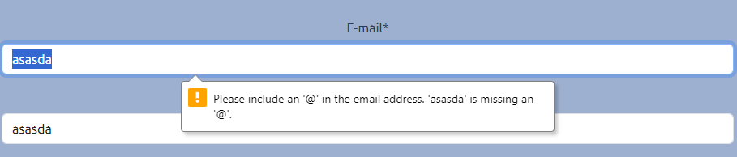

Multiple @

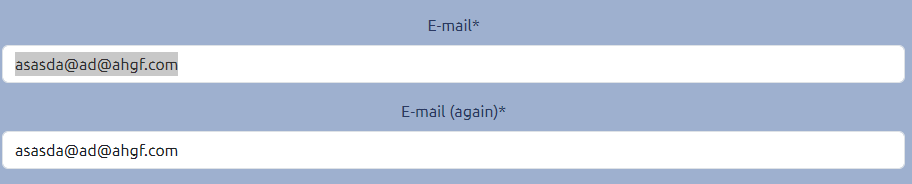

Nothing before @

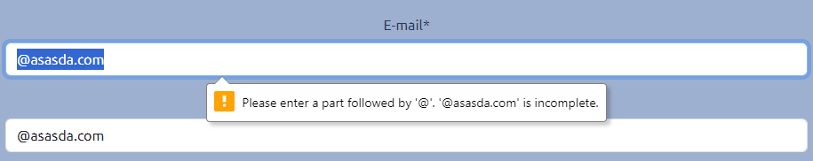

Nothing after @

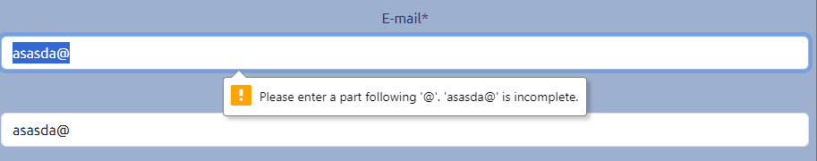

---

### Is the entered password suitable

Test:

    Ensure that the application only accepts suitable passwords.

Directions:

    1.  Navigate from the navbar to register.
    2.  Enter valid email address:
    3.  Enter unsuitable password

        No password

        Password too short

        Password too common – password

    4.  Click on Sign Up

Expected result:

    Email address is rejected as invalid.

Actual result:

    Email address is rejected as invalid.

No password

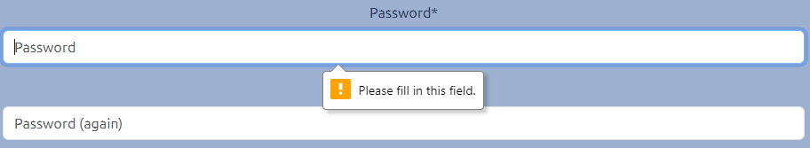

Password too short – min 8 chars

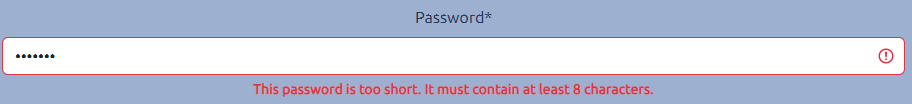

Password too common

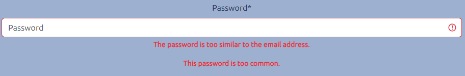

---

### Email address and password valid

Test:

    Ensure that the app accepts a valid email and password combination for registration.

Directions:

    1.  Navigate from the navbar to register.
    2.  Enter valid email address and password

        test@pcsgwatford.co.uk

        sgee15p01

    3.  Click on Sign Up

Expected result:

    Email address and password are accepted as invalid, and a confirmation email is received.

Actual result:

    Email address and password are accepted as invalid, and a confirmation is received.

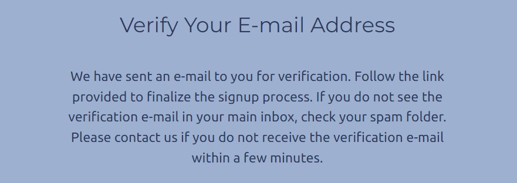

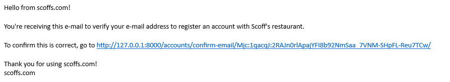

Upon clicking the link in the email, the user is directed to the verification page.

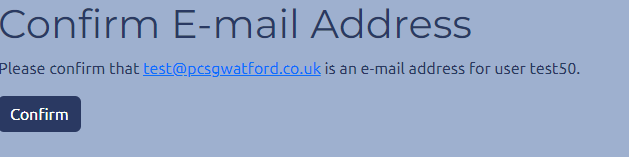

Clicking on confirm here allows the user to login and they are directed to the home page.

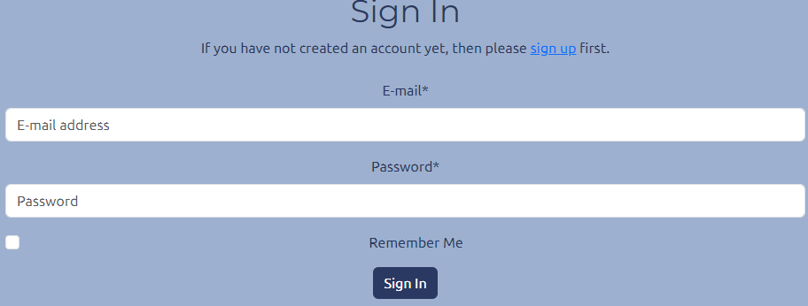

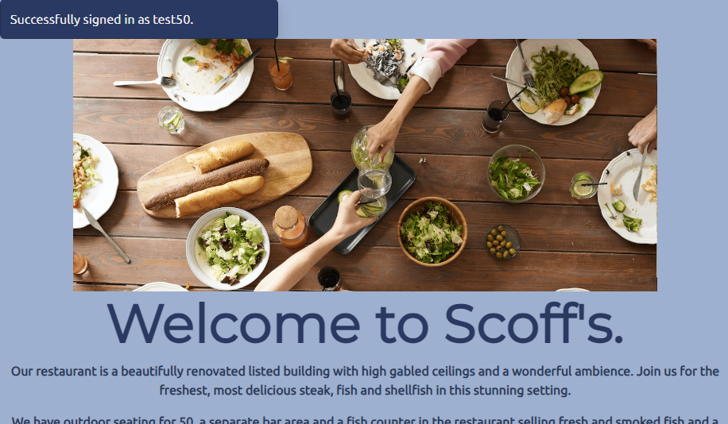

---

## User Functions

### User can logout

Test:

    Ensure that a logged in user can logout.

Directions:

    1.  From a logged in state, click on logout in the navbar.
    2.  Confirm the logout message.

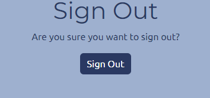

Expected result:

    The user is logged out and directed to the home page.

Actual result:

    The user is logged out and directed to the home page.

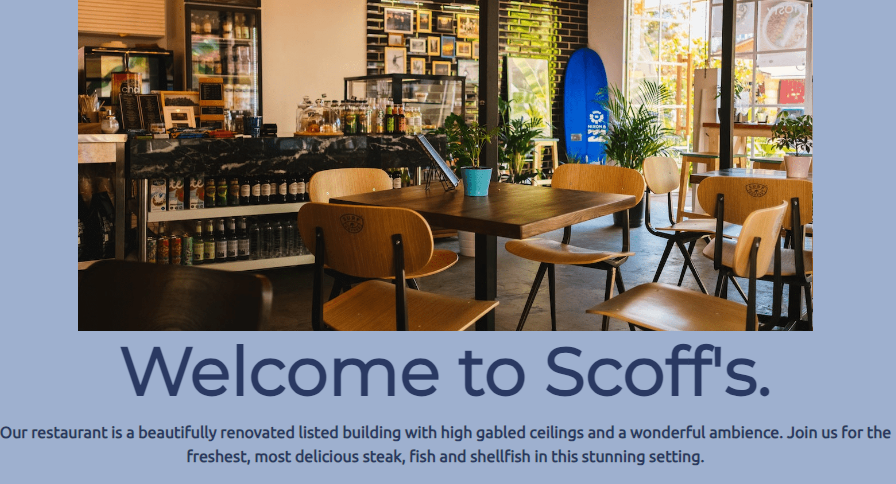

---
## Navigtion

### Link Tests

The Following links were tested.

| Location           | Link                          | Destination        |
|--------------------|-------------------------------|--------------------|
| Navbar             | Home                          | Home               |
|                    | Register                      | Signup             |
|                    | Login                         | Login              |
|                    | Logout                        | Logout             |
|                    | Book a Table                  | Book a Table       |
|                    | List your Bookings            | List your Bookings |
| Homepage           | Book a Table                  | Book a Table       |
| Footer             | Facebook                      | Facebook           |
|                    | Instagram                     | Instagram          |
|                    | Twitter                       | Twitter            |
|                    | Youtube                       | Youtube            |
| Make a Booking     | Save Booking                  | List your Bookings |
| List your Bookings | Edit button on booking card   | Edit booking       |
|                    | Delete button on booking card | Delete booking     |
|

All links went to the stated destinations.

---

## Application Testing

### Book a table.

Test:

    Ensure that a logged in user can create a reservation.

Directions:

    1.  Navigate from the navbar to Book a Table
    2.  Enter the details requested…
    3.  name – Mark
    4.  Party Size – 8
    5.  Date – any date from today onwards.
    6.  Any time from the dropdown.
    7.  Click “Save Booking”

Expected result:

    The table is booked with a confirmation message.

Actual result:

    The table is booked with a confirmation message, and the database shows the booked table.

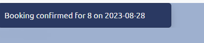

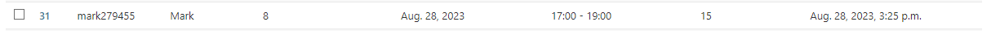

\-----------------------------------------------

### Edit a booking

Test:

    Ensure that a logged in user can edit a booking.

Directions:

    Click on “List your Bookings”, and click on the edit button on the booking to be edited.

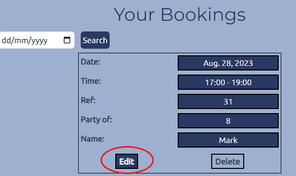

    Change a detail on the edit form. - Party size: 12

    Click save.

Expected result:

    The edit is accepted and a confirmation shown

Actual result:

    The booking edit is accepted, and a confirmation message is shown.

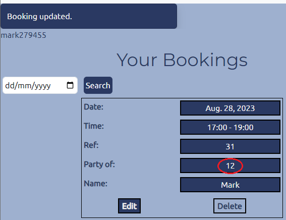

\-----------------------------------------------

### Delete a booking

Test:

    Ensure that a logged in user can delete a booking.

Directions:

    Click on “List your Bookings”, and click on the delete button on the booking to be edited.

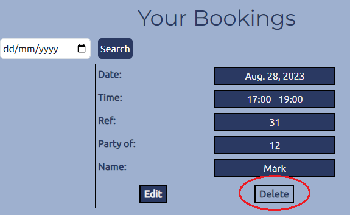

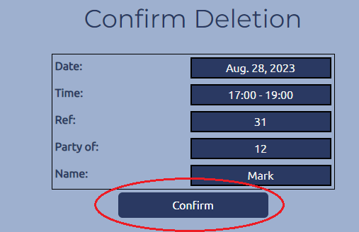

    Click on Confirm

Expected result:

    The deletion is accepted and a confirmation shown.

Actual result:

    The deletion is accepted, and a confirmation message is shown.

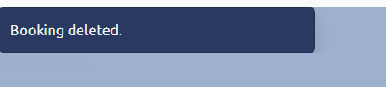

---

### Form Validation

#### Empty Fields

Test:

    Ensure that empty input in Make a Booking form is rejected.

Directions:

    1.  Navigate to the Make a Booking page
    2.  Either:

        a.  Populate the name field
        b.  Populate the Date field using the Datepicker

    3.  Click Save Booking

Expected result:

    The form validation provides a "Please fill in this field" message, indicating the empty field.

Actual result:

    The form validation provides a "Please fill in this field" message, indicating the empty field.

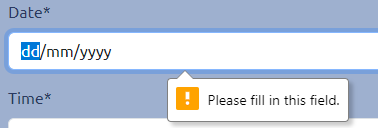

---

#### Booking date requested from the past

Test:

    Ensure that bookings may not be made in the past.

Directions:

    1.  Navigate to the Make a Booking page
    2.  Populate the Date field using the Datepicker using a date before today
    3.  Click Save Booking

Expected result:

    The form validation provides a "Invalid date - Booking cannot be in the past" message.

Actual result:

    The form validation provides a "Invalid date - Booking cannot be in the past" message.

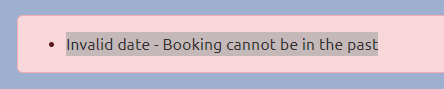

---

### Booking cannot be made if the party size is greater than the biggest table

Test:

    Ensure that a booking cannot be made where the party size is bigger than the biggest table. 

Directions:

    1.  Navigate to the Make a Booking page
    2.  Fill out all fields and set the party size to 20.
    3.  Click Save Booking

Expected result:

    The application responds with the message "No tables available for this date and time".

Actual result:

    The application responds with the message "No tables available for this date and time".

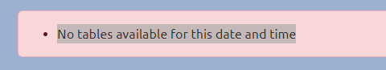

---

### Booking cannot be edited to increase the party size so that its greater than the biggest table

Test:

    Ensure that a booking cannot be edited to a situation where the party size is bigger than the biggest table.

Directions:

    1.  Navigate to the List your Bookings page
    2.  Edit an existing Booking.
    3.  Set the party size to 20.
    3.  Click Save Booking

Expected result:

    The application responds with the message "Sorry, we do not have a table available for that amount of guests".

Actual result:

    The application responds with the message "Sorry, we do not have a table available for that amount of guests".

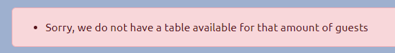

---

# Industry Tests

---

## W3 HTML Validator

The following pages were submitted to the W3 HTML Validator (https://validator.w3.org/)
homepage 
register
Logout
Login
Make a Booking
List your Bookings
Edit Booking
Delete Booking

## Lighthouse
## Wave
## Pep8
