# Manual Testing

## User Authentication

### Is the entered email address of a valid format?

Test:

Ensure that the application only accepts valid email addresses

Directions:

1.  Navigate from the navbar to register.
2.  Enter invalid email address:

omit @ sign.

insert address with multiple @ signs.

insert address with nothing before – or nothing after @ sign.

1.  Click on Sign Up

Expected result:

Email address is rejected as invalid.

Actual result:

Email address is rejected as invalid.

Missing @

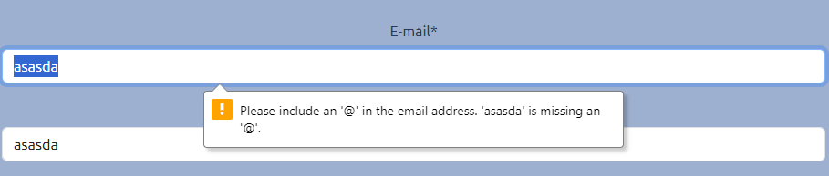

Multiple @

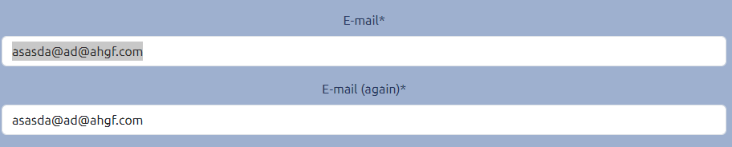

Nothing before @

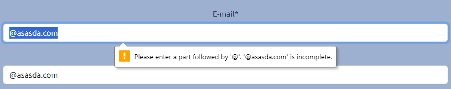

Nothing after @

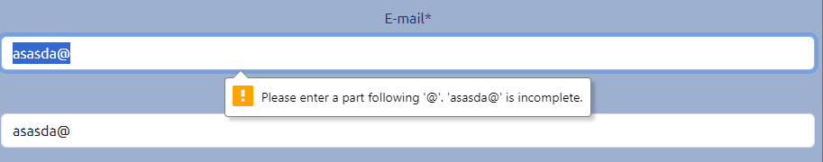

\-----------------------------------------------

### Is the entered password suitable?

Test:

Ensure that the application only accepts suitable passwords.

Directions:

1.  Navigate from the navbar to register.
2.  Enter valid email address:
3.  Enter unsuitable password

    No password

    Password too short

    Password too common – password

4.  Click on Sign Up

Expected result:

Email address is rejected as invalid.

Actual result:

Email address is rejected as invalid.

No password

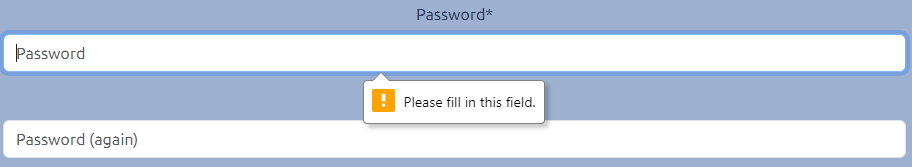

Password too short – min 8 chars

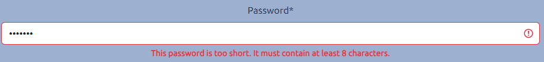

Password too common

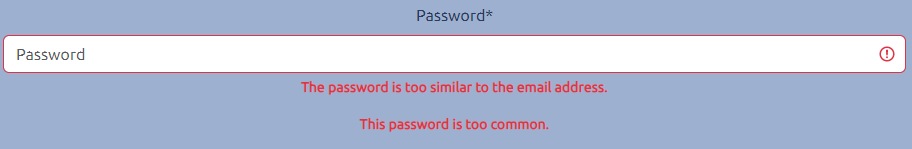

\-----------------------------------------------

### Email address and password valid

Test:

Ensure that the app accepts a valid email and password combination for registration.

Directions:

1.  Navigate from the navbar to register.
2.  Enter valid email address and password

    test@pcsgwatford.co.uk

    sgee15p01

3.  Click on Sign Up

Expected result:

Email address and password are accepted as invalid, and a confirmation email is received.

Actual result:

Email address and password are accepted as invalid, and a confirmation is received.

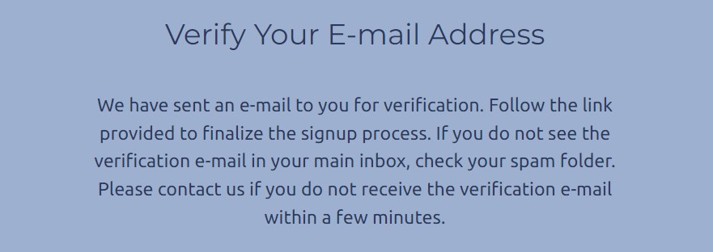

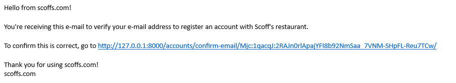

Upon clicking the link in the email, the user is directed to the verification page.

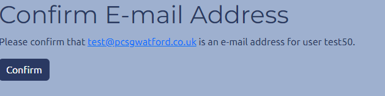

Clicking on confirm here allows the user to login and they are directed to the home page.

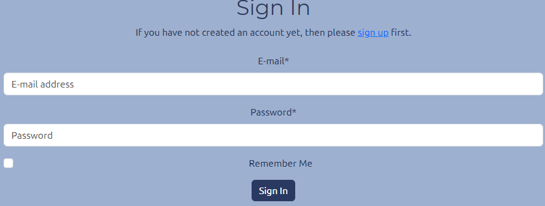

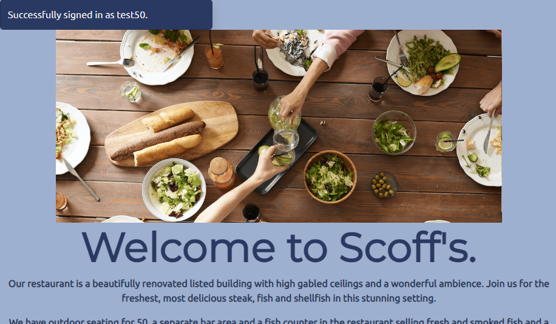

\-----------------------------------------------

### User can logout

Test:

Ensure that a logged in user can logout.

Directions:

1.  From a logged in state, click on logout in the navbar.
2.  Confirm the logout message.

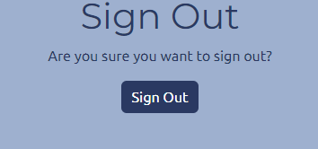

Expected result:

The user is logged out and directed to the home page.

Actual result:

The user is logged out and directed to the home page.

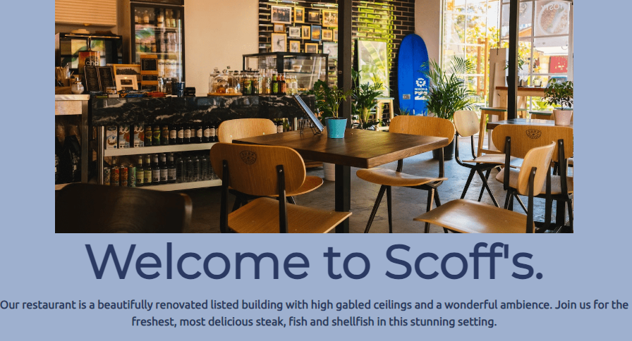

\-----------------------------------------------

### Book a table.

Test:

Ensure that a logged in user can create a reservation.

Directions:

1.  Navigate from the navbar to Book a Table
2.  Enter the details requested…
3.  name – Mark
4.  Party Size – 8
5.  Date – any date from today onwards.
6.  Any time from the dropdown.
7.  Click “Save Booking”

Expected result:

The table is booked with a confirmation message.

Actual result:

The table is booked with a confirmation message, and the database shows the booked table.

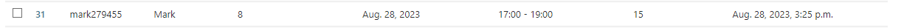

\-----------------------------------------------

### Edit a booking

Test:

Ensure that a logged in user can edit a booking.

Directions:

Click on “List your Bookings”, and click on the edit button on the booking to be edited.

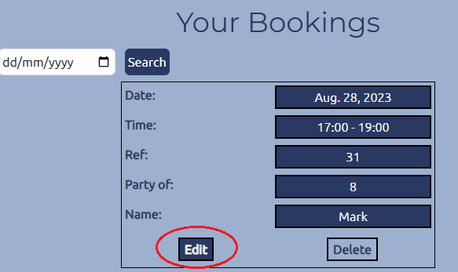

Change a detail on the edit form. - Party size: 12

Click save.

Expected result:

The edit is accepted and a confirmation shown

Actual result:

The booking edit is accepted, and a confirmation message is shown.

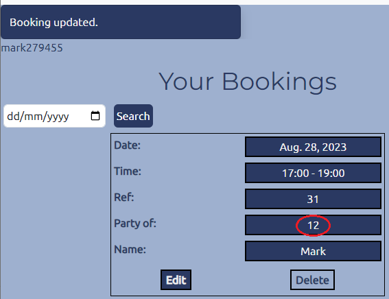

\-----------------------------------------------

### Delete a booking

Test:

Ensure that a logged in user can delete a booking.

Directions:

Click on “List your Bookings”, and click on the delete button on the booking to be edited.

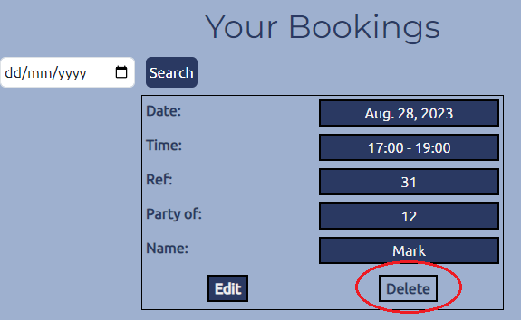

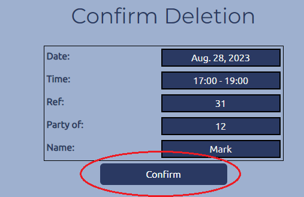

Click on Confirm

Expected result:

The deletion is accepted and a confirmation shown.

Actual result:

The deletion is accepted, and a confirmation message is shown.

